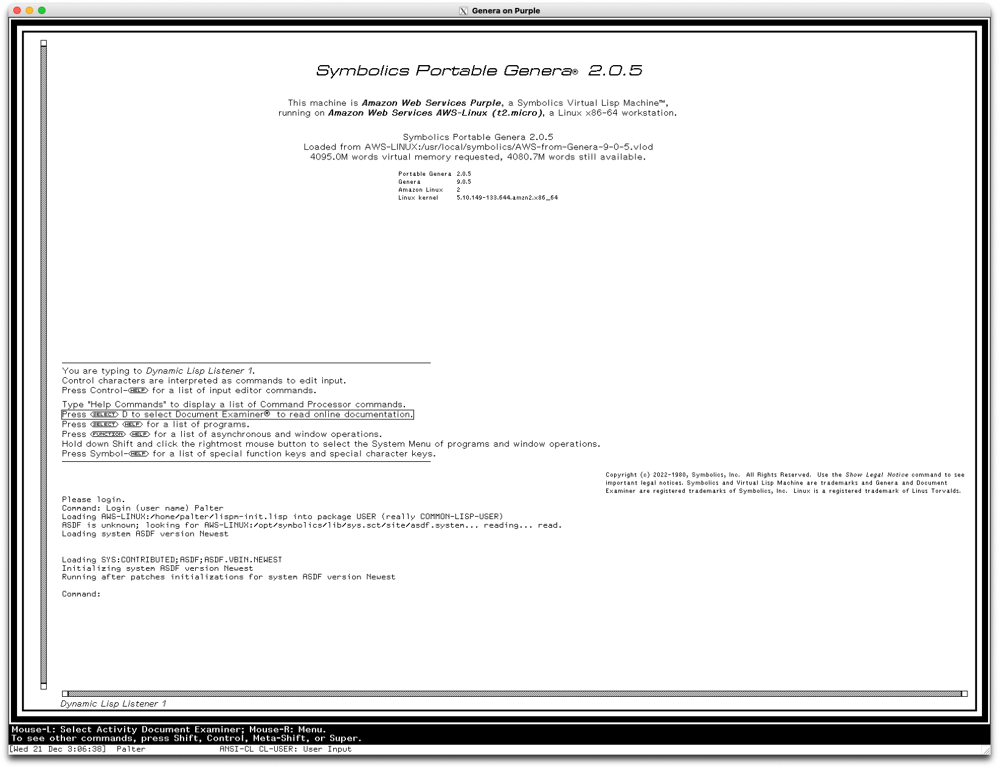
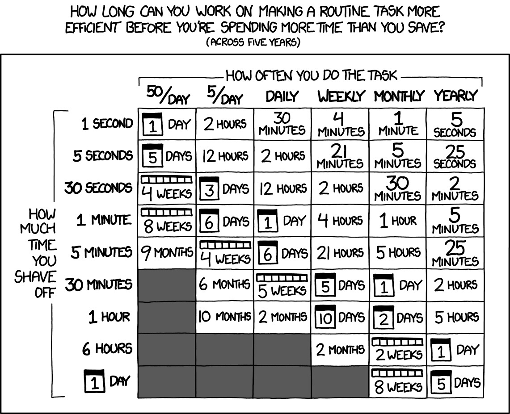

:PROPERTIES:
:ID:       BA5BE445-3F7A-4956-835B-59598355E4DB
:END:
#+TITLE: Emaxxing
#+AUTHOR: Jure Smolar
#+STARTUP: overview

* Cheat sheet
| Keybind     | Action               | Notes                                                                               |
|-------------+----------------------+-------------------------------------------------------------------------------------|
| =M-x=         | =M-x=                  | The list of all interactive functions.                                              |
| =C-g=         | quit/cancel          | You press this any time something goes wrong.                                       |
| =C-x p=       | =project-prefix-map=   | Emacs' built in project management system.                                          |
| =C-x 0=       | close window         | There's "no more" of this window.                                                   |
| =C-x 1=       | close other windows  | Only "one" window left.                                                             |
| =C-x 2=       | split window down    | One simply gets used to 2 vs 3.                                                     |
| =C-x 3=       | split window left    |                                                                                     |
| =C-x t ...=   | tab management       | Hint: 0123 work the same; =C-x t 0= closes the current tab etc.                       |
| =C-x 5 ...=   | frame management     | Likewise follows the 0123 conventions.                                              |
| =C-x 4 c=     | make indirect buffer | Make a copy of the current buffer with a different point.                           |
|             |                      |                                                                                     |
| Info system |                      | Killer feature - using this we can introspect all of Emacs.                         |
| =C-h= or =<f1>= | Help map             | I rebind =C-h= to backspace, so I use =<f1>= exclusively.                               |
| =<f1> f=      | =describe-function=    | Get documentation for function of a given name.                                     |
| =<f1> v=      | =describe-variable=    | Get documentation for variable of a given name.                                     |
| =<f1> k=      | =describe-keybind=     | Get the documentation for whatever is bound to a given key.                         |
| =<f1> b=      | =describe-bindings=    | Search through all active keybinds. When called with =M-x= it gives a results buffer. |
(Preostanek bomo izpolnili skupaj na delavnici)

* Emacs

* Zgodovina
- Emacs je družina urejevalnikov prvotno napisanih v 70ih
- 1976 (Richard Stallman): Najprej nabor makrov za urejevalnik [[https://en.wikipedia.org/wiki/TECO_(text_editor)][TECO]] (Editor MACroS)
- 1976 (Dan Weinreb): [[https://en.wikipedia.org/wiki/EINE_and_ZWEI][EINE]] (EINE is not Emacs) in kasneje ZWEI (ZWEI was Eine Initially) - Emacslike urejevalnika za [[https://en.wikipedia.org/wiki/Lisp_machine][Lisp machines]]
- 1978 (Bernard Greenberg): [[https://en.wikipedia.org/wiki/Multics_Emacs][Multics Emacs]] - napisan in ekstenzibilen v Maclisp
- 1980 (Zmacs): [[https://en.wikipedia.org/wiki/Zmacs][Zmacs]] - Naslednik ZWEI za [[https://en.wikipedia.org/wiki/Symbolics][Symbolics]] Lisp Machine; komercialno uporabljan do 1997
- 1981 (James Gosling): [[https://en.wikipedia.org/wiki/Gosling_Emacs][Gosling Emacs]] - Napisan v C, ekstenzibilen v "Mocklisp" jeziku
- 1983: Gosling začne prodajati Emacs
- 1984: Stallman začne z izdelavo GNU Emacs kot prvi GNU projekt. C jedro (cca 20% kode), jezik /Emacs lisp/ za preostanek in razširitev
- 1985 (Dave Conroy): [[https://en.wikipedia.org/wiki/MicroEMACS][MicroEMACS]] - Majhen, prenosljiv Emacs v C; osnova za Pico in nano; Linus Torvalds ga še vedno uporablja
- 1986 (mg): Javno-domenski Emacs klon, osnovan na MicroEMACS, a bližje GNU Emacs; privzeti urejevalnik OpenBSD in macOS
- 1991: [[https://en.wikipedia.org/wiki/XEmacs][XEmacs]]: Defunct, nekaj časa največja konkurenca GNU Emacsu.
- 2009–2015 (Robin Templeton): [[https://www.emacswiki.org/emacs/GuileEmacs][Guile-Emacs]] - Projekt za zamenjavo Elisp stroja z GNU Guile (Scheme); serija GSoC projektov; še vedno v razvoju. "Emacs prihodnosti"
- 2017 (John Mercouris): [[https://nyxt.atlas.engineer/][Nyxt]] (sprva imenovan nEXT) - spletni brskalnik napisan v Common Lisp, razširljiv v Lispu, navdih Emacs/Vim
- ~2017 (cxxxr): [[https://github.com/lem-project/lem][Lem]] - splošnonamenski urejevalnik/IDE napisan in razširljiv v Common Lisp

* Lisp machines

- Emacs posnema filozofijo [[https://en.wikipedia.org/wiki/Lisp_machine][Lisp machines]] .
- Celoten sistem je živ in spremenljiv med tekom. OS, urejevalnik, debugger, aplikacije.
- Vsak objekt si lahko pogledal, skočil na kodo, jo spremenil, ob napaki šel nazaj.
- Emacs je zgrajen na istem modelu, znotraj samega urejevalnika.
- Nanj lahko gledamo kot operacijski sistem v smislu da nadzira procese, ima paketni sistem, programe, ipd.
- Ne razlikujemo med kodo programa in njegovo konfiguracijo.
- To nam omogoča, da programe znotraj Emacsa poljubno šravfamo in povezujemo.
    
* Emacs in Vim
- Klasična primerjava: Vi(m)
- Vim je model modalnega urejanja s svojo zbirko 
- Emacs v resnici zamenja ne (le) Vim, ampak 
- Hkrati Emacs kot popolnost ekstenzije podpira Vi model (in tudi druge modalne sisteme).
- Imamo vgrajen =viper-mode=, ki doda modalnost. Ta skuša emulirati sam vi.
- Imamo (najbolj znan) paket [[https://github.com/emacs-evil/evil][evil-mode]], ki skupaj z [[https://github.com/emacs-evil/evil-collection][evil-collection]] (in drugimi dodatki) prinese Vim bindings na praktično vse dele Emacsa.
- NB je =evil-mode= več kot le "insertion-layer" dodatek. Podpira večino Vim features, tudi Ex komande in registre.
- V ozadju je še zmeraj Emacsov model - text buffer in ekstenzibilnost z Emacs lisp.
- Evil mode zato /ne podpira/ VimL dodatkov, je pa velika količina ported v Emacs lisp.
- Further reading: [[https://ryanfaulhaber.com/posts/cool-emacs-evil/][Cool Emacs Things: Evil - Ryan Faulhaber]]
- Po drugi strani se Neovim vedno bolj približuje Emacsu kot program, ki ga odpreš, ki ima svoj terminal emulator, je programabilen v "resničnem jeziku"
- Če uporabimo [[https://fennel-lang.org][Fennel]] celo postane Emacs v striktnem smislu urejevalnika teksta ekstenzibilnega v lispu.
* Kaj je Emacs?
- Text buffer-based operacijski sistem
- Grafični program
- Emacs lisp interpreter

* Ekstenzibilnost

* Malo o keybinds
- =C= in =M= (Ctrl in Alt)
- =C-c C-c=
- =C-c n f=
- Vsaka tipka zažene poljubno funkcijo
- Chording
- Mnemonika
- Primer: Narrowing

  
* Demo!
- Dired kurzorji
- Org Roam in Agenda
- Elfeed in logging
- Zapiski in spletna stran
- Po želji

  * test
#+begin_src python :results output
def f(x, y):
    return x + y

print(f(3, 2))
#+end_src

#+RESULTS:
: 5

* Poglejmo si osnovno konfiguracijo!
Emacs bere iz prve obstoječe datoteke in zažene začetno datoteko (ki je Emacs lisp program)
- =.emacs= 
- =.emacs.d/init.el= (najbolj standard)
Zaenkrat bomo stvari poganjali na roke.
- =.config/emacs/init.el=
* Package Management
We use the built-in ~package.el~ with MELPA and GNU ELPA as sources, and ~use-package~ as the declarative configuration macro throughout.

#+begin_src emacs-lisp :tangle init.el
;;; init.el --- A minimal Emacs config for learning ;;; -*- lexical-binding: t; -*-

;;; * Initial package management
(require 'package)
(setq package-archives '(("melpa" . "https://melpa.org/packages/")
                         ("gnu" . "https://elpa.gnu.org/packages/")))
(package-initialize)
(package-refresh-contents)
(require 'use-package)
(setq use-package-always-ensure t) 	; Install packages automatically

(use-package exec-path-from-shell	; For MacOS users, stabilises shell paths
  :functions exec-path-from-shell-initialize
  :init (exec-path-from-shell-initialize))

;; Use a custom-file to avoid cluttering init.el
(setq custom-file (expand-file-name "custom.el" user-emacs-directory))
#+end_src

#+RESULTS:
: /Users/jure/.emacs.d/custom.el

Hint: Go into the source block and press =C-c C-c=.
* Themes and aesthetics
Doom themes is a nice selection of themes from the [[https://github.com/doomemacs/doomemacs][Doom Emacs]] framework.

#+begin_src emacs-lisp :tangle init.el
;;; * Aesthetics
(use-package doom-themes
  :init
  (mapc #'disable-theme custom-enabled-themes)
  (load-theme 'doom-solarized-light) 	; My preferred theme
  ;; (load-theme 'doom-solarized-dark)
  )
#+end_src

#+RESULTS:

For nerd-icons, we need [[https://github.com/ryanoasis/nerd-fonts/releases/download/v3.4.0/NerdFontsSymbolsOnly.zip][Symbols Nerd Font (Download)]].
#+begin_src emacs-lisp :tangle init.el
  (use-package nerd-icons 		; Pretty unicode symbols
    :defer t)

  (use-package doom-modeline		; A more aesthetic modeline
    :init
    (doom-modeline-mode 1)
    :custom
    (doom-modeline-icon t)		; Add nerd-icon support to the modeline
    :config
    (cond ((eq system-type 'gnu/linux)
  	 (setq doom-modeline-height 12))
  	(t (setq doom-modeline-height 24)))) 
#+end_src

#+RESULTS:
: t

* Presentation Utilities
These helpers make it easy to spin up a fresh Emacs instance using any directory
as its =--init-directory=. Useful for demoing isolated configs during a talk.

- =run-emacs-with-directory= :: prompts for a directory and launches Emacs with it
- =run-emacs-with-current-directory= :: uses the current buffer's directory
  - =C-u= prefix enables =--debug-init=
  - =C-u C-u= prefix runs with =-Q= (no init file at all)

#+begin_src emacs-lisp :tangle init.el
;;; * Presentation specific config
(defun run-emacs-with-directory (directory &optional arg)
  (interactive "DDirectory: \nP")
  (let ((args (cond ((equal arg '(16)) '("-Q"))
                    (t (list "--init-directory" (expand-file-name directory))))))
    (when (equal arg '(4))
      (setq args (cons "--debug-init" args)))
    (apply #'start-process "emacs" nil "emacs" args)))

(defun run-emacs-with-current-directory (&optional arg)
  "Run Emacs with the current file's directory as the configuration directory.
Calling with single prefix ARG (C-u) enables debugging.
Calling with double prefix ARG (C-u C-u) runs Emacs with -Q."
  (interactive "P")
  (let* ((current-dir (if buffer-file-name
                          (file-name-directory buffer-file-name)
                        default-directory)))
    (run-emacs-with-directory current-dir arg)))
#+end_src

#+RESULTS:
: run-emacs-with-current-directory

[[https://codeberg.org/phmcc/outline-stars][outline-stars]] renders =;;; *=-style comment headers as a proper outline, making
=prog-mode= files navigable like org files. =<backtab>= cycles the buffer outline.

#+begin_src emacs-lisp :tangle init.el
(use-package outline-stars		; Sections in comments
  :vc (:url "https://codeberg.org/phmcc/outline-stars")
  :custom
  (outline-stars-level-1-overline)
  (outline-start-default-state 'folded)
  :config
  (outline-stars-mode 1)
  :bind
  (:map prog-mode-map
	("<backtab>" . outline-stars-cycle-buffer))
  )
;;; * Basic configuration

#+end_src

#+RESULTS:
: outline-stars-cycle-buffer

* Essential Packages
** Completion and Help
*** which-key
Displays available keybindings in a popup after a short delay. Essential for
discoverability.

#+begin_src emacs-lisp :tangle init.el
;;; * Essential packages
;;; ** Completion and help
(use-package which-key			; Keybind completion
  :init (which-key-mode)
  :diminish which-key-mode
  :custom (which-key-idle-delay 0.01))

(use-package marginalia 		; Command completion annotations
  :init (marginalia-mode))
#+end_src

*** counsel / ivy / swiper
Ivy is a completion framework; counsel wraps standard Emacs commands with ivy;
swiper replaces isearch. Key customisations:

- ~ivy--regex-ignore-order~ :: match all query words regardless of order
- ~swiper-use-visual-line-p~ set to ~#'ignore~ :: prevents slowness on very long lines

#+begin_src emacs-lisp :tangle init.el
(use-package counsel			; Completion framework
  :custom
  (ivy-use-virtual-buffers nil)
  (ivy-count-format "(%d/%d) ")
  (ivy-initial-inputs-alist nil)
  ;; (ivy-dynamic-exhibit-delay-ms 250)
  :bind (("C-s" . swiper)
	 ;; ("s-b" . counsel-switch-buffer)
	 ;; ("M-s s" . swiper-isearch)
	 ;; ("M-s a" . swiper-all)
	 :map ivy-minibuffer-map
         ("TAB" . ivy-alt-done))
  :config
  (ivy-mode 1)
  (counsel-mode)
  ;; NOTE: My preference; I'm not great at remembering order.
  (setq ivy-re-builders-alist '((t . ivy--regex-ignore-order)))
  (setq swiper-use-visual-line-p #'ignore) ; Fix for very long files
  )

(use-package ivy-rich			; Some improvements for ivy
  :after ivy
  :config (ivy-rich-mode 1))
#+end_src

** Editing
*** expreg
Incrementally expands the region by syntactic units. Bound to =s-f= (super).

#+begin_src emacs-lisp :tangle init.el
;;; ** Editing
(use-package expreg 			; Cursor expansion
  :custom
  (expreg-restore-point-on-quit t)
  ;; NOTE: I use the super key which might not be bound on not-macos by default
  :bind ("s-f" . expreg-expand)
  )
#+end_src

*** multiple-cursors + phi-search
- Place cursors on multiple matches and edit them simultaneously.
- ~phi-search~ replaces the default isearch inside a multi-cursor session.

| Binding       | Action                  |
|---------------+-------------------------|
| =s-<down>=      | mark next like this     |
| =s-<up>=        | mark previous like this |
| =s-M-<up/down>= | unmark next/previous    |
| =s-d=           | mark all (dwim)         |
| =s-r=           | edit lines              |
| =s-<mouse-1>=   | add cursor on click     |

#+begin_src emacs-lisp :tangle init.el
(use-package multiple-cursors		; Multiple cursors
  :defines mc/keymap
  :defer nil
  :bind (("s-<down>" . mc/mark-next-like-this)
	 ("s-<up>" . mc/mark-previous-like-this)
	 ("s-M-<up>" . mc/unmark-next-like-this)
	 ("s-M-<down>" . mc/unmark-previous-like-this)
	 ("s-d" . mc/mark-all-dwim)
	 ("s-r" . mc/edit-lines)
	 ("s-<mouse-1>" . mc/add-cursor-on-click)
	 :map mc/keymap
	 ("<return>" . nil))		; This allows us to make a newline at each cursor. Exit with C-g
  )

(use-package phi-search)		; In-line search for multiple cursors
#+end_src

*** iedit
Edit all occurrences of a symbol in the buffer simultaneously. Toggle with =C-;=.

#+begin_src emacs-lisp :tangle init.el
(use-package iedit			; Editing multiple things at the same time
  :bind ("C-;" . iedit-mode))
#+end_src

** Undo
~undo-fu~ provides linear undo/redo on top of Emacs's branching undo history.
~vundo~ visualises the full undo tree interactively.

#+begin_src emacs-lisp :tangle init.el
;;; ** Undo
(use-package undo-fu
  :bind (("s-z" . undo-fu-only-undo) 	; NOTE: Again, make sure to bind super
	 ("s-Z" . undo-fu-only-redo)))

(use-package vundo			; Undo-tree
  :custom
  (vundo-glyph-alist vundo-unicode-symbols)
  :bind
  ("C-x u" . vundo))
#+end_src

** Searching and Jumping
*** deadgrep

Ripgrep integration. Opens results in a dedicated buffer. Bound to =<f5>=.

#+begin_src emacs-lisp :tangle init.el
;;; ** Searching and jumping
(use-package deadgrep			; Ripgrep integration
  :bind ("<f5>" . deadgrep))
#+end_src

*** flash
Jump anywhere on screen (or across windows) using a label-based interface,
similar to avy/ace-jump. Notable options:

- ~flash-multi-window~ :: jump across all visible windows
- ~flash-rainbow~ :: colour-coded labels
- ~flash-autojump nil~ :: don't auto-jump on unique match (easier to follow)

#+begin_src emacs-lisp :tangle init.el
(use-package flash			; Jumping all over the screen
  :commands (flash-jump flash-jump-continue
			flash-treesitter)
  :bind ("s-j" . flash-jump)		; NOTE: Make sure super is bound
  :custom
  (flash-multi-window t)
  (flash-rainbow t)
  (flash-rainbow-shade 8)
  (flash-autojump nil) 			; It's hard to keep track of when you get there
  )
#+end_src

** Lisp Programming
#+begin_src emacs-lisp :tangle init.el
;;; ** Lisp programming
(use-package lisp-mode
  :ensure nil  ; built-in package
  :hook ((emacs-lisp-mode . setup-check-parens)
         (common-lisp-mode . setup-check-parens)
         (scheme-mode . setup-check-parens)
         (clojure-mode . setup-check-parens)
	 (racket-mode . setup-check-parens))
  :config
  (defun setup-check-parens ()
    (add-hook 'before-save-hook #'check-parens nil t)))

(use-package paren			; Oklepaji
  :init
  (electric-pair-mode 1)		; Avtomatično banansiraj oklepaje
  (show-paren-mode 1)
  :config
  (defun js/fix-angle-bracket-syntax ()
    "Make < and > punctuation instead of paired delimiters."
    (modify-syntax-entry ?< ".")
    (modify-syntax-entry ?> "."))
  :custom
  (show-paren-delay 0)
  :hook
  (LaTeX-mode . js/fix-angle-bracket-syntax)
  (org-mode . js/fix-angle-bracket-syntax))

(use-package rainbow-delimiters
  :defer t
  :hook prog-mode)

#+end_src

* Info in dokumentacija
Helpful improves the builtin help system and gives more comprehensive documentation buffers for functions, keys, and variables.

#+begin_src emacs-lisp :tangle init.el
;;; ** Helpful
(use-package helpful
  :bind (("<f1> f" . helpful-callable)
         ("<f1> v" . helpful-variable)
         ("<f1> k" . helpful-key)
         :map help-map
         ("p" . helpful-at-point)
	 :map helpful-mode-map
	 ("q" . quit-window--and-kill))
  :custom
  (helpful-switch-buffer-function #'switch-to-buffer)
  (help-window-select t))		; Always jump to the help buffer
#+end_src

* Magit
The definitive git interface for Emacs. ~magit-todos~ surfaces TODO/FIXME comments from the repo directly in the Magit status buffer.

#+begin_src emacs-lisp :tangle init.el
;;; ** Magit
(use-package magit
  :defer t
  :bind
  (("C-x g" . magit-status)
   ("C-x f" . magit-file-dispatch))
  :custom
  (magit-display-buffer-function #'magit-display-buffer-same-window-except-diff-v1)
  (magit-process-connection-type nil)
  )

(use-package hl-todo
  :config
  (global-hl-todo-mode 1))

(use-package magit-todos
  :after magit
  :config
  (magit-todos-mode 1))
#+end_src

* Org mode (dopolnimo, če ostane kaj časa)
